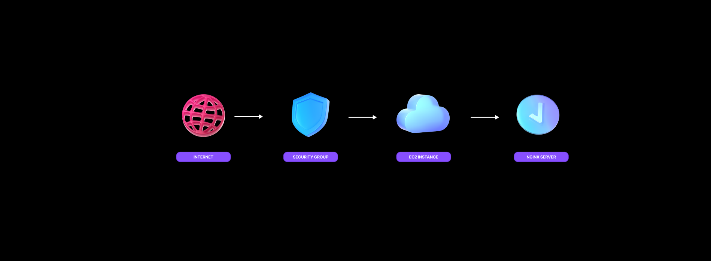
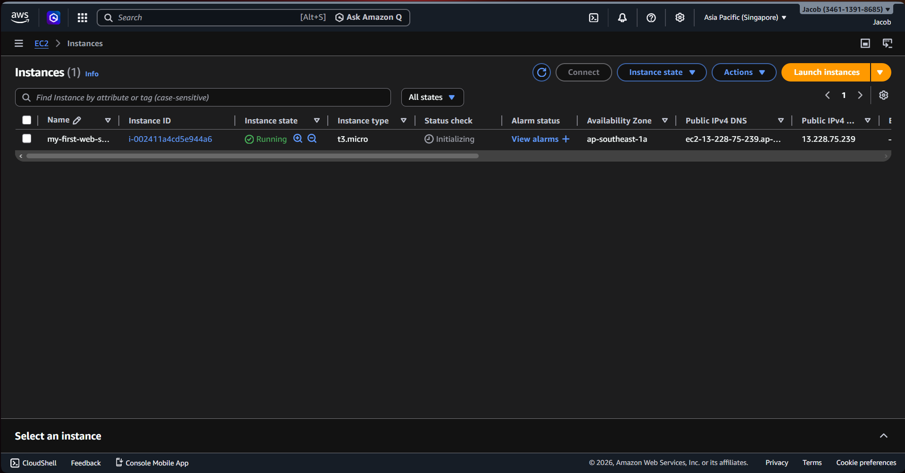

# Project 01 – Deploying a Web Server on AWS EC2

This project demonstrates how to deploy a simple web server on AWS using an EC2 instance and configure network access through Security Groups.
The goal is to understand the basic workflow of launching cloud infrastructure, connecting to a server, installing a web server, and exposing it to the internet.

---

## Architecture



```
Internet
   │
   ▼
Security Group
├─ Port 22 : SSH
└─ Port 80 : HTTP
   │
   ▼
EC2 Instance (t3.micro)
├─ Ubuntu 24.04
└─ Nginx Web Server
```

---

## Live Result

A landing page hosted on an EC2 instance and served using Nginx.


---

## Technologies Used

**Cloud**

* AWS EC2
* Security Groups

**Server**

* Ubuntu 24.04 LTS
* Nginx

**Tools**

* Linux CLI
* Git

**Website Template**

* https://github.com/flexdinesh/dev-landing-page

---

## Deployment Process

### 1. Launch EC2 Instance

Configuration used:

* Instance type: `t3.micro` (AWS Free Tier)
* AMI: Ubuntu 24.04 LTS
* Security Group: SSH (22) + HTTP (80)
* Key Pair created for SSH access



---

### 2. Configure Security Group

* secure SSH access : open port 22
* public HTTP access to the website : open port 80


---

### 3. Connect to the Server

```
ssh -i my-ec2-key.pem ubuntu@<PUBLIC_IP>
```

---

### 4. Install Nginx

```
sudo apt update
sudo apt install nginx -y
sudo systemctl enable nginx
sudo systemctl start nginx
```

---

### 5. Deploy Website Files

```
cd /tmp
git clone https://github.com/flexdinesh/dev-landing-page.git

sudo rm -rf /var/www/html/*
sudo cp -r dev-landing-page/* /var/www/html/

sudo chown -R www-data:www-data /var/www/html
sudo chmod -R 755 /var/www/html
```

---

## Key Takeaways

### Security Groups act as the instance firewall

All inbound traffic is blocked by default.
Only explicitly allowed ports can be accessed.

In this project:

* Port **22** allows SSH access
* Port **80** allows web traffic

---

### SSH uses key-based authentication

Access to the server is secured using a private key:

```
ssh -i my-key.pem ubuntu@server-ip
```
Correct file permissions are required:

```
chmod 400 my-key.pem
```

---

### Web server file permissions matter

Nginx runs as the `www-data` user.

Proper ownership and permissions are required to avoid access errors.

```
www-data:www-data
```

